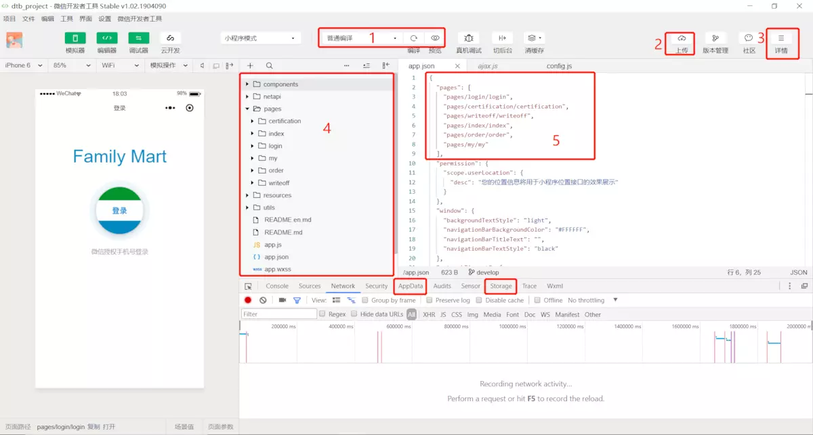
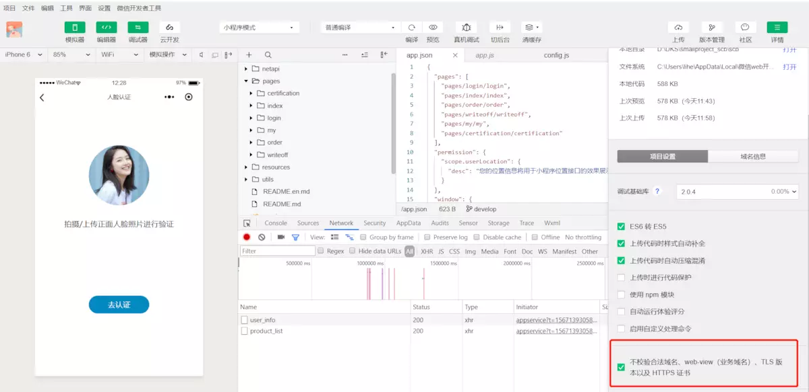
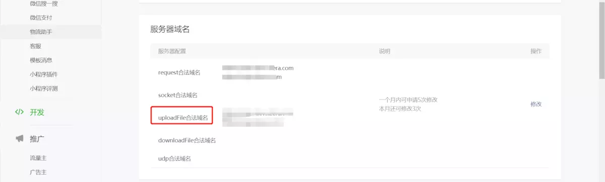

[小程序开发指南](https://developers.weixin.qq.com/ebook?action=get_post_info&docid=0008aeea9a8978ab0086a685851c0a)  | [微信小程序官网](https://developers.weixin.qq.com/miniprogram/dev/framework/) | [微信开发者工具下载](https://developers.weixin.qq.com/miniprogram/dev/devtools/download.html)

如果对小程序一点都不熟悉的话，可以先到官网看文档熟悉熟悉，这里主要是我在看官网文档做项目的过程中的一些记录，也是自己对基础知识的一个巩固，会不断完善。对了，如果逻辑上没有问题，但在微信开发者工具上就显示不了预期的效果，那记得真机调试下，有时候真的就是微信开发者工具的bug，亲身经历。

### 一、微信开发者工具


 1. 编译里可对页面设置参数
 2. 点击“上传”可上传到微信小程序后台管理以进行发布体验版或者正式版等。
 3. 如果小程序要求兼容到iOS8以下版本，需要开启样式自动补全。开启样式自动补全，在“设置”—“项目设置”—勾选“上传代码时样式自动补全”。
 4. 右击目录选择“新建pages和新建component”会自动生成对应页面
 5. 想看哪个页面，就可以把app.json中pages里的那个页面路径移到第一个就可以

- app.wxss里的样式为全局样式，但不会应用到components组件里
- 事件以bind或者catch开头 + 事件类型。例如：bindtap、catchtouchstart...

### 二、小程序后台管理[需要账号]
  - 小程序名称【发布前可修改2次】、小程序简称【一年内可修改2次】、小程序头像【一年内可申请修改5次】、小程序介绍【一个月可申请5次】、服务类目【一个月可申请3次】

### 三、小程序相关知识点

#### 1、通过App()注册小程序，通过getApp()获取全局对象
```javascript
    //app.js  App()注册一个小程序、小程序的入口方法【必须在app.js 中注册，且不能注册多个】
    App({
      globalData: {
        userInfo:null,
        helloFromApp:'Hello,I am From App.js'
      },
      test:function(){
          console.log('test');
      }
    })
```
```javascript
    // getApp()：通过getApp获取全局对象，然后进行全局变量和全局方法的使用
    // 其他页面中想调用全局变量和方法时
    var app = getApp();
    console.log(app.globalData.helloFromApp); // 调用全局变量
    app.test(); 
```

#### 2、生命周期
  **整个小程序生命周期 App({})**
  ```js
//app.js
App({
    onLaunch: function (options) {
        // 小程序初始化完成时（全局只触发一次） 
        // 程序销毁（过一段时间没有执行，或者手动删除了小程序后再次添加）之后，再次启动就会执行
        console.log('onLaunch'); 
    },
    onShow: function (options) {
        // 小程序启动，或从后台进入前台显示时
        console.log('onShow');
    },
    onHide: function () {
        // 小程序从前台进入后台时,就会执行
        console.log('onHide');
    },
    onError: function (msg) {
        // 小程序发生脚本错误，或者 api 调用失败时触发，会带上错误信息
        console.log(msg)
    },
    globalData: {
        userInfo: null
    }
})
```
**页面生命周期 page({})**
```js
Page({ 
  onLoad: function (options) {
    // 监听页面加载
    // 页面加载的时候执行，只执行一次
    console.log('页面load');
  },
  onReady: function () {
    // 监听页面第一次渲染完成
    // 只执行一次
    console.log('页面ready');
  },
  onShow: function () {
    // 只要页面显示，就会执行
    console.log('页面show');
  },
  onHide: function () {
    // 页面隐藏，就会执行
    console.log('页面hide');
  },
  onUnload: function () {
    // 页面卸载，就会执行
    console.log('页面unload');
  }
})
```
**组件生命周期** [官网介绍组件生命周期](https://developers.weixin.qq.com/miniprogram/dev/framework/custom-component/lifetimes.html)
注意:
>1. tab页面之间的相互切换，不会让页面重新加载(onLoad)，也就不会卸载(onUnload)，只会隐藏与显示页面，即：页面切换只会交替执行 onHide() 与 onShow() 函数
>2. 在某页面使用 NavigatorTo 跳转至目标页面时（比如从 index 页面跳转至 detail 页面），该页面（index页面）只执行 onHide(), 目标页面（detail页面）执行 onLoad()、onReady()、onShow()；
>3. 在回退（NavigatorBack）时（比如从 detail 页面回退至 index 页面），index页面执行onShow(), detail页面会被卸载，即执行onUnload()；


#### 3、路由
- wx.navigateTo, wx.redirectTo 只能打开非 tabBar 页面。
- wx.switchTab 只能打开 tabBar 页面。
- reLaunch可以打开任意页面, 但是没有返回按钮，需要定义一个可以点击回退的按钮。
- 页面底部的 tabBar 由页面决定，即只要是定义为 tabBar 的页面，底部都有 tabBar。
- 调用页面路由带的参数可以在目标页面的onLoad中获取。
- 路由传参

```html
<!-- pages/list/list.wxml -->
<view class="list" >
    <view class='box'  wx:for='{{list}}' wx:key='{{index}}' data-id='{{item.id}}' bindtap='goDetail'>
        <image src='{{item.img}}'></image>
        <view class='tip'>
            <text>{{item.title}}</text>
            <text class='price'>￥{{item.price}}</text>
        </view> 
    </view> 
</view>
```

```js
//pages/list/list.js
goDetail (e) {
    console.log(e.currentTarget.dataset.id),
    // 进入详情页时 传递 id
    wx.navigateTo({
        url: `/pages/detail/detail?id=${e.currentTarget.dataset.id}`,
    })
},

// pages/detail/detail.js
Page({
    data: {
        detail: {},
        loading: true
    }, 
    onLoad: function (options) {
        console.log(options.id) // 拿到列表页传过来的 id
    }
})
```


#### 4、布局-flex
```css
/* flex不单是一个属性，它包含了一套新的属性集。属性集包括用于设置容器，和用于设置项目两部分 */
/* 设置容器的属性有: */
display:flex;

flex-direction:row（默认值） | row-reverse | column |column-reverse

flex-wrap:nowrap（默认值） | wrap | wrap-reverse

justify-content:flex-start（默认值） | flex-end | center |space-between | space-around | space-evenly

align-items:stretch（默认值） | center  | flex-end | baseline | flex-start

align-content:stretch（默认值） | flex-start | center |flex-end | space-between | space-around | space-evenly

/* 设置项目的属性有 */

order:0（默认值） | <integer>

flex-shrink:1（默认值） | <number>

flex-grow:0（默认值） | <number>

flex-basis:auto（默认值） | <length>

flex:none | auto | @flex-grow @flex-shrink @flex-basis
align-self:auto（默认值） | flex-start | flex-end |center | baseline| stretch
```

#### 5、数据存储
- 每个小程序的缓存空间上限为10MB，如果当前缓存已经达到10MB，再通过wx.setStorage写入缓存会触发fail回调


#### 6、组件使用
--待更新

[微信小程序template模板与component组件的区别和使用](https://www.cnblogs.com/xyyt/p/9559326.html)

### 四、小程序常用功能
- 上传图片：wx.uploadFile

```javascript
//从本地相册选择图片或使用相机拍照。
wx.chooseImage({
  success (res) {
    const tempFilePaths = res.tempFilePaths
    wx.uploadFile({
      //仅为示例，非真实的接口地址
      url: 'https://example.weixin.qq.com/upload', 
      filePath: tempFilePaths[0],
      name: 'file',
      formData: {
        'user': 'test'
      },
      success (res){
        const data = res.data
        //do something
      }
    })
  }
})
```
有时候调用wx.uploadFile会提示“fail url not in domain list”，是因为没有勾选“不校验合法域名、web-view（业务域名）、TLS 版本以及 HTTPS 证书”



如果未勾选的话，需要在后台配置合法域名



- 更新机制

```javascript
//放在了app.js的onLaunch方法里了,发布的第一版不会生效，下一版才会生效的
// 获取小程序更新机制兼容
//wx.canIUse 判断小程序的API，回调，参数，组件等是否在当前版本可用
if (wx.canIUse('getUpdateManager')) {
    const updateManager = wx.getUpdateManager()
    updateManager.onCheckForUpdate(function (res) {
    // 请求完新版本信息的回调
    if (res.hasUpdate) {
        updateManager.onUpdateReady(function () {
        wx.showModal({
            title: '更新提示',
            content: '新版本已经准备好，是否重启应用？',
            success: function (res) {
            if (res.confirm) {
                // 新的版本已经下载好，调用 applyUpdate 应用新版本并重启
                updateManager.applyUpdate()
            }
            }
        })
        })
        updateManager.onUpdateFailed(function () {
        // 新的版本下载失败
        wx.showModal({
            title: '已经有新版本了哟~',
            content: '新版本已经上线啦~，请您删除当前小程序，重新搜索打开哟~',
        })
        })
    }
    })
} else {
    // 如果希望用户在最新版本的客户端上体验您的小程序，可以这样子提示
    wx.showModal({
    title: '提示',
    content: '当前微信版本过低，无法使用该功能，请升级到最新微信版本后重试。'
    })
}
```

- 直接获取微信头像

```javascript
<open-data type="groupName" open-gid="xxxxxx"></open-data>
<open-data type="userAvatarUrl"></open-data>
<open-data type="userGender" lang="zh_CN"></open-data>
```

- 微信扫一扫功能

```javascript
wx.scanCode({
  success: (res) => {
    console.log(res)
  }
})
```


- 利用wx.getNetworkType获取网络状态

```javascript
wx.getNetworkType({
    success: function(res) {
        // networkType字段的有效值：
        // wifi/2g/3g/4g/unknown(Android下不常见的网络类型)/none(无网络)
        if (res.networkType == 'wifi') {
            // 从网络上下载pdf文档
            wx.downloadFile({
                url:'http://test.com/somefile.pdf',
                success: function (res) {
                    // 下载成功之后进行预览文档
                    wx.openDocument({filePath: res.tempFilePath})
                }
            })
        } else {
            wx.showToast({ title: '当前为非Wifi环境' })
        }
    }
})
```

### 小程序图表可参考[wx-charts](https://www.cnblogs.com/zxf100/p/9956415.html)

### [微信JS-SDK在H5中如何使用](https://developers.weixin.qq.com/doc/offiaccount/OA_Web_Apps/JS-SDK.html)
- 微信JS-SDK是微信公众平台 面向网页开发者提供的基于微信内的网页开发工具包


- [微信小程序获取手机号](https://developers.weixin.qq.com/miniprogram/dev/framework/open-ability/getPhoneNumber.html)
- [微信小程序登录授权并获取手机号](https://www.cnblogs.com/liubingyjui/p/12321788.html)
